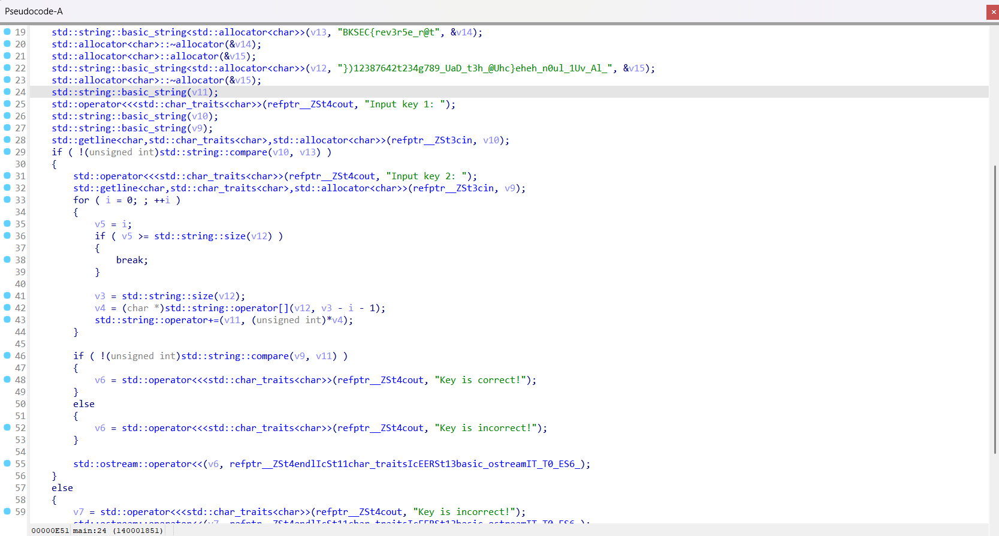

# BABY OIL 1
---
## Loại : RE

## Question : Để bước chân vào con đường làm Reverser chân chính bạn cần điều gì:
 1. **IDA Pro của Spid3r (Bản nào cũng đều chill cả nhé)**
 2. **Lòng dũng cảm sử dụng file này trên máy thật của bạn**

## Link file : [baby_ida_1](chall.exe)
---
### Decompile bằng ida ta có pseudo sau : 
```C++ pseudpseudo
int __fastcall main(int argc, const char **argv, const char **envp)
{
    __int64 v3; // rax
    char *v4; // rax
    unsigned __int64 v5; // rbx
    __int64 v6; // rax
    __int64 v7; // rax
    char v9[32]; // [rsp+20h] [rbp-B0h] BYREF
    char v10[32]; // [rsp+40h] [rbp-90h] BYREF
    char v11[32]; // [rsp+60h] [rbp-70h] BYREF
    char v12[32]; // [rsp+80h] [rbp-50h] BYREF
    char v13[42]; // [rsp+A0h] [rbp-30h] BYREF
    char v14; // [rsp+CAh] [rbp-6h] BYREF
    char v15; // [rsp+CBh] [rbp-5h] BYREF
    int i; // [rsp+CCh] [rbp-4h]

    _main(argc, argv, envp);
    std::allocator<char>::allocator(&v14);
    std::string::basic_string<std::allocator<char>>(v13, "BKSEC{rev3r5e_r@t", &v14);
    std::allocator<char>::~allocator(&v14);
    std::allocator<char>::allocator(&v15);
    std::string::basic_string<std::allocator<char>>(v12, "})12387642t234g789_UaD_t3h_@Uhc}eheh_n0ul_1Uv_Al_", &v15);
    std::allocator<char>::~allocator(&v15);
    std::string::basic_string(v11);
    std::operator<<<std::char_traits<char>>(refptr__ZSt4cout, "Input key 1: ");
    std::string::basic_string(v10);
    std::string::basic_string(v9);
    std::getline<char,std::char_traits<char>,std::allocator<char>>(refptr__ZSt3cin, v10);
    if ( !(unsigned int)std::string::compare(v10, v13) )
    {
        std::operator<<<std::char_traits<char>>(refptr__ZSt4cout, "Input key 2: ");
        std::getline<char,std::char_traits<char>,std::allocator<char>>(refptr__ZSt3cin, v9);
        for ( i = 0; ; ++i )
        {
            v5 = i;
            if ( v5 >= std::string::size(v12) )
            {
                break;
            }

            v3 = std::string::size(v12);
            v4 = (char *)std::string::operator[](v12, v3 - i - 1);
            std::string::operator+=(v11, (unsigned int)*v4);
        }

        if ( !(unsigned int)std::string::compare(v9, v11) )
        {
            v6 = std::operator<<<std::char_traits<char>>(refptr__ZSt4cout, "Key is correct!");
        }
        else
        {
            v6 = std::operator<<<std::char_traits<char>>(refptr__ZSt4cout, "Key is incorrect!");
        }

        std::ostream::operator<<(v6, refptr__ZSt4endlIcSt11char_traitsIcEERSt13basic_ostreamIT_T0_ES6_);
    }
    else
    {
        v7 = std::operator<<<std::char_traits<char>>(refptr__ZSt4cout, "Key is incorrect!");
        std::ostream::operator<<(v7, refptr__ZSt4endlIcSt11char_traitsIcEERSt13basic_ostreamIT_T0_ES6_);
    }

    std::string::~string(v9);
    std::string::~string(v10);
    std::string::~string(v11);
    std::string::~string(v12);
    std::string::~string(v13);
    return 0;
}
```
### Dễ dàng nhận thấy, **v13** và **v12** là 2 phần của flag, 1 phần chứa flag và một phần flag khác bị obfuscate. 



### Xuống dưới đó một xíu, có thể thấy rõ yêu cầu nhhập2 key này. Ở input key 1, user nhập vào chuỗi **BKSEC{rev3r5e_r@t** chương trình sẽ hiển thị yêu cầu nhập key 2. Bên dưới đó có một đoạn code như sau : 
```C++ pseudo
for ( i = 0; ; ++i )
        {
            v5 = i;
            if ( v5 >= std::string::size(v12) )
            {
                break;
            }

            v3 = std::string::size(v12);
            v4 = (char *)std::string::operator[](v12, v3 - i - 1);
            std::string::operator+=(v11, (unsigned int)*v4);
        }

        if ( !(unsigned int)std::string::compare(v9, v11) )
        {
            v6 = std::operator<<<std::char_traits<char>>(refptr__ZSt4cout, "Key is correct!");
        }
        else
        {
            v6 = std::operator<<<std::char_traits<char>>(refptr__ZSt4cout, "Key is incorrect!");
        }

        std::ostream::operator<<(v6, refptr__ZSt4endlIcSt11char_traitsIcEERSt13basic_ostreamIT_T0_ES6_);
```
### Có thể thấy rõ đây là đoạn code dùng để đảo kí tự của chuỗi, vd “efefd” sẽ thành “dfefe” khi đưa vào trong đoạn code trên. Vậy nên chúng ta chỉ cần đảo ngược các kí tự của chuỗi })12387642t234g789_UaD_t3h_@Uhc}eheh_n0ul_1Uv_Al_ và ghép nó với v13 sẽ được flag hoàn chỉnh :vv 

Flag : 
```
BKSEC{rev3r5e_r@t_lA_vU1_lu0n_hehe}chU@_h3t_DaU_987g432t24678321)}
```
( Note : Flag không check được nên chưa biết đúng hay sai ) 

Link file : [baby_ida_1](chall.exe)

