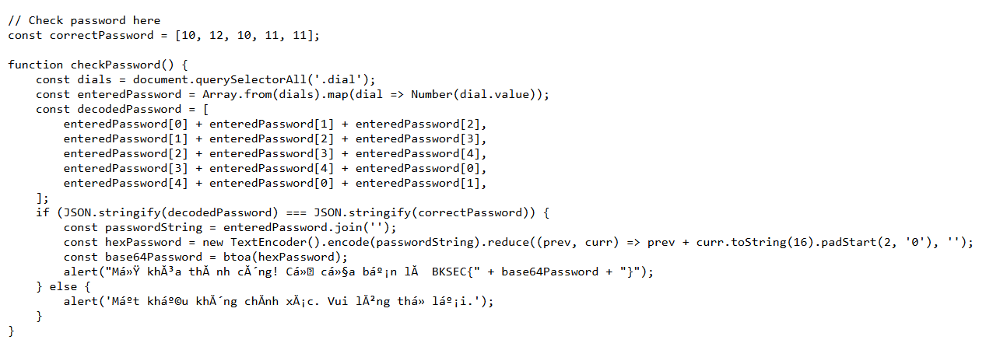
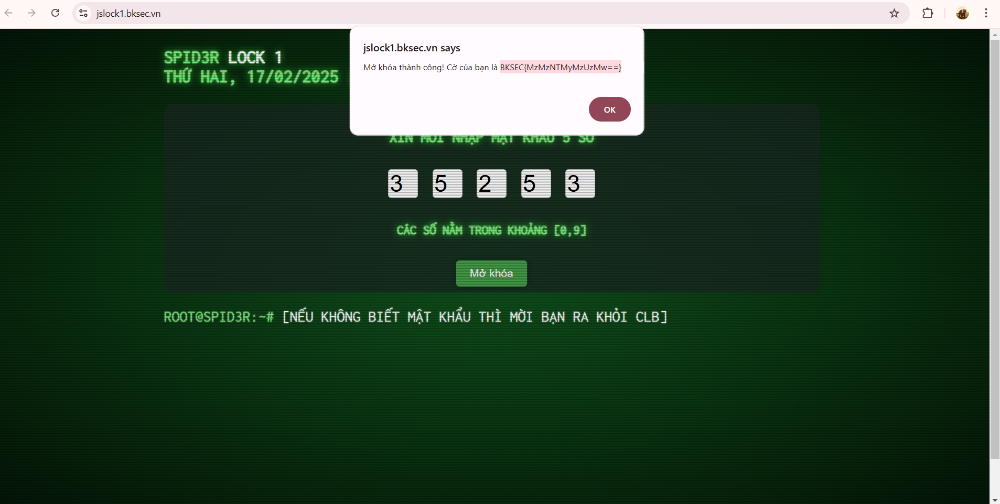

# JSLOCK

### Trước hết, ta có thể xác định được file lock trong frontend như sau :

### Sau đó, chỉ cần giải pt sao cho **decodedPassword** và **correctPassword** bằng nhau là dc. Kết quả sẽ ra được pwd là 35253, nhập vào và ta sẽ có flag như sau :

